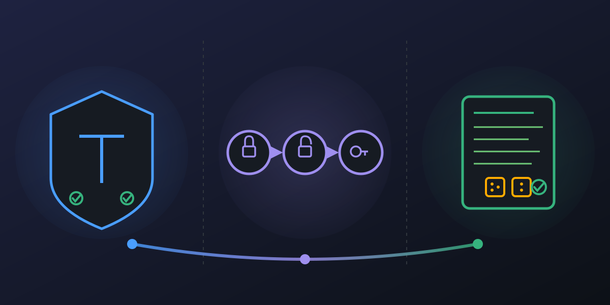

# design-by-provable-contracts

<p align="center">
  
</p>

[](https://github.com/paiml/design-by-provable-contracts/actions/workflows/ci.yml)
[](#license)
[](https://www.rust-lang.org/)
[](#install)
[](contracts/)

Companion repository for the **Design by Provable Contracts** Coursera
course — course 7 of the
[Rust for Data Engineering](https://www.coursera.org/specializations/rust-for-data-engineering)
specialization.

## The `pv` workflow

**Every demo in this repo is gated by [`pv`](https://github.com/paiml/aprender/tree/main/crates/aprender-contracts-cli)**
— the `provable-contracts` CLI from
[`aprender-contracts`](https://github.com/paiml/aprender). The YAML
contracts in [`contracts/`](contracts/) are the single source of
truth; the Rust crates are the implementations `pv` scores them
against.

```bash
make install      # cargo install aprender-contracts-cli
make validate     # pv validate every contract — schema gate
make explain      # pv explain every contract — human-readable
make score        # pv score every contract  — 5-dim rubric grade
make lint         # pv lint   every contract — validate + audit + score
make codegen      # pv codegen → debug_assert! you paste into the kernel
make demo         # run the 3 demo binaries pv's contracts gate
```

See `make help` for the full list (20+ targets across `pv` subcommands
and quality gates).

## Contracts

| Contract | Module | What it proves |
|---|---|---|
| [`contracts/money-v1.yaml`](contracts/money-v1.yaml) | M2 newtype | `Money<C> + Money<C>` is currency-safe; mixed currencies fail to compile |
| [`contracts/connection-v1.yaml`](contracts/connection-v1.yaml) | M3 typestate | `query` only compiles on `Connection<Authenticated>` |
| [`contracts/safe-div-v1.yaml`](contracts/safe-div-v1.yaml) | M4 proptest | `safe_div` is total over `i32 × i32`; never panics |

Each contract declares a formula, domain, codomain, invariants, proof
obligations, falsification tests, and a Kani harness stub. `pv
validate` enforces the schema; `pv score` grades the contract across
five dimensions (Spec / Falsify / Kani / Lean / Bind); the demo
binaries assert the runtime half of the proof.

## Demos

| Crate | Lesson coverage | Gating contract | Demo binary |
|---|---|---|---|
| [`m2-newtype`](m2-newtype/) | M2.1 newtype / PhantomData / Deref + M2.2 currency-unit | `money-v1.yaml` | `money-demo` |
| [`m3-typestate`](m3-typestate/) | M3.1 typestate / consume-return / typed builder + M3.2 connection | `connection-v1.yaml` | `typestate-demo` |
| [`m4-proptest`](m4-proptest/) | M4.1 proptest / shrinking / round-trip + M4.2 parser-edge + M5 contract-driven API | `safe-div-v1.yaml` | `safediv-demo` |

## The four pillars

1. **Type-system invariants** — illegal states cannot be constructed (M2)
2. **Typestate programming** — protocol violations are compile errors (M3)
3. **Property-based testing** — `proptest` shrinks counterexamples to minimal failing inputs (M4)
4. **YAML contracts + `pv`** — runtime obligations declared once, validated, scored, and runtime-asserted (all 3 modules)

## Prerequisites

- Rust 1.75+ (`rustup default stable`)
- `aprender-contracts-cli` for `pv` (the contract validator + scorer)
- Optional: `pmat` for the advisory PAIML compliance report
- Optional: `cargo-llvm-cov` for the 100% line-coverage gate

```bash
make install
```

## Quick start

```bash
git clone https://github.com/paiml/design-by-provable-contracts
cd design-by-provable-contracts
make install

# Gate the contracts (schema + rubric)
make validate      # 0 errors per contract
make score         # prints the 5-dim rubric per contract

# Build + run the demos pv's contracts gate
make build
make demo

# Full pre-merge gate (fmt + clippy + test + coverage + pv lint)
make ci
```

## The `pv` subcommand surface (what each target invokes)

| Target | Subcommand | Purpose |
|---|---|---|
| `make validate` | `pv validate` | Parse and schema-check the YAML |
| `make explain` | `pv explain` | Print the contract in human-readable form |
| `make score` | `pv score` | 5-dimension rubric (Spec / Falsify / Kani / Lean / Bind) |
| `make lint` | `pv lint` | Validate + audit + score in one pass |
| `make audit` | `pv audit` | Traceability audit across obligations |
| `make status` | `pv status` | Equations, obligations, falsification coverage |
| `make graph` | `pv graph` | Contract dependency graph (deps + refs) |
| `make codegen` | `pv codegen` | Emit `debug_assert!` statements you paste into the kernel |
| `make kani-stubs` | `pv kani` | Emit Kani proof-harness stubs |
| `make lean-stubs` | `pv lean` | Emit Lean 4 theorem stubs |
| `make probar-stubs` | `pv probar` | Emit `probar` property-test stubs |
| `make invariants` | `pv invariants` | Emit type-invariant trait + Kani preservation harness |
| `make scaffold` | `pv scaffold` | Emit Rust trait + test scaffolding |
| `make generate` | `pv generate` | Emit all artifacts (scaffold + Kani + probar) at once |
| `make proof-status` | `pv proof-status` | Hierarchical proof levels (L1-L5) across all contracts |
| `make coverage` | `pv coverage` | Cross-contract obligation coverage report |

## How a `pv`-gated demo works (M4 walk-through)

1. **The contract.** `contracts/safe-div-v1.yaml` declares: `safe_div` returns `None` on `b == 0` and on `(i32::MIN, -1)`, and `Some(a / b)` otherwise. It lists 5 invariants, 5 proof obligations, and 5 falsification tests.
2. **`pv validate contracts/safe-div-v1.yaml`** → 0 errors, the YAML is well-formed.
3. **`pv score contracts/safe-div-v1.yaml`** → 0.47 / Grade D. Falsify is perfect (1.00); Kani is partial (0.18); Lean is zero. The score tells you what to add next.
4. **`pv codegen`** emits `debug_assert!(safe_div(_, 0).is_none())` and friends — you paste these into the kernel.
5. **`cargo test -p m4-proptest`** runs the proptest harness — millions of `(a, b)` pairs against `safe_div`, shrunk on failure.
6. **`cargo run --bin safediv-demo -- 5 0`** runs the binary; it prints the contract marker (`contract: safe-div-v1 ✓`) and exits zero. The marker is the runtime half of the proof.

The same pattern repeats for `money-v1.yaml` (M2) and `connection-v1.yaml` (M3), except M2 + M3's contracts are enforced by `rustc` so the "demo binary" is mostly there to confirm `cargo build` succeeded with the right types.

## Repository layout

```
contracts/
  money-v1.yaml          ← M2 newtype contract
  connection-v1.yaml     ← M3 typestate contract
  safe-div-v1.yaml       ← M4 proptest contract
m2-newtype/              ← Money<C> implementation + money-demo binary
m3-typestate/            ← Connection<S> implementation + typestate-demo binary
m4-proptest/             ← safe_div implementation + safediv-demo binary + proptest harness
.github/workflows/ci.yml ← pv-gated CI: fmt + clippy + test + cov + pv validate + runtime asserts
Makefile                 ← all pv subcommands + quality gates
```

## CI gates (every push, every PR)

The [CI workflow](.github/workflows/ci.yml) runs nine steps. All gates
on every push:

1. `cargo fmt --check`
2. `cargo build --workspace --locked`
3. `cargo test --workspace --locked` (includes proptest with shrinking)
4. `cargo llvm-cov --fail-under-lines 100` (100% line coverage)
5. `cargo clippy --all-targets -- -D warnings`
6. `cargo install aprender-contracts-cli` (provides `pv`)
7. **`pv validate contracts/`** — schema gate on all 3 contracts
8. **`pv lint contracts/`** — validate + audit + score on all 3
9. **Runtime contract assertions** for M2, M3, M4 demos (zero-exit = pass)
10. `pmat comply check` (advisory)

The contracts are the source of truth; nothing ships without `pv`
agreeing the YAML is well-formed and every runtime assertion holds.

## Go deeper

The production contract engine lives in
[`paiml/aprender`](https://github.com/paiml/aprender) under
`crates/aprender-contracts` and `crates/aprender-contracts-cli`. This
teaching repo is the small, end-to-end-readable version.

For more `pv` workflows and the contract language, see:
- [`pv --help`](https://github.com/paiml/aprender/tree/main/crates/aprender-contracts-cli) — 27 subcommands
- [`aprender-contracts` README](https://github.com/paiml/aprender/tree/main/crates/aprender-contracts) — the engine itself
- The rest of the [Rust for Data Engineering](https://www.coursera.org/specializations/rust-for-data-engineering) specialization

## License

Dual-licensed under MIT or Apache-2.0 — pick the one that fits your
downstream use. SPDX: `MIT OR Apache-2.0`.
